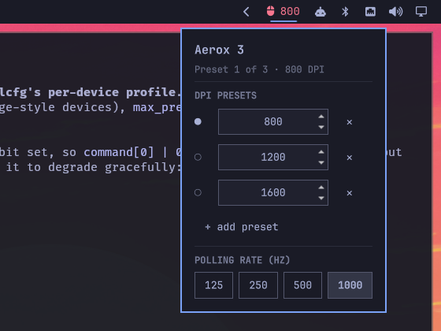

# Aerox 3

Omarchy shell plugin for the SteelSeries Aerox 3: edit the DPI preset table
and polling rate from the bar, and follow the physical DPI button live.



## What it does

The mouse holds up to five DPI presets and cycles between them when you press
the button behind the scroll wheel. The panel shows that table, marks the
active preset, and lets you edit any value, add or remove presets (1–5), and
change the polling rate.

Press the physical button and the panel follows — the mouse pushes an
unsolicited HID report on every press carrying both the active index and the
whole preset table, so what you see is what the device reported, not a cached
guess.

## Requirements

- [`rivalcfg`](https://github.com/flozz/rivalcfg) (AUR), used as a Python
  library rather than through its CLI — see "Why not the CLI" below.
- `jq`
- The udev rules `rivalcfg` installs, so the mouse is writable without root.
  After installing, either replug the mouse or run:
  `sudo udevadm control --reload-rules && sudo udevadm trigger`

## Install

```bash
omarchy plugin enable dfrost.aerox3 right
```

Bind a key to open the panel:

```
omarchy-shell dfrost.aerox3 toggle
```

## How it works

```
Panel.qml ──> scripts/aerox3 ──> scripts/aerox3-device ──> rivalcfg ──> mouse
     ^              |                     |
     |              v                     | watch
     |     ~/.local/state/omarchy/        |
     └──── aerox3.json <──────────────────┘
```

`scripts/aerox3` owns validation and the state file and speaks JSON.
`scripts/aerox3-device` owns the hardware: writes through rivalcfg's library,
and `watch` decodes DPI-button reports into JSON lines.

### Why not the rivalcfg CLI

`rivalcfg --sensitivity 800,1200,1600` always activates the *first* preset.
The underlying command carries a selected-preset byte that the CLI never
exposes, so switching the active preset requires the library:

```python
mouse.set_sensitivity("800,1200,1600", selected_preset)
```

### Reading the device

There is no "what are your settings?" command. The mouse only speaks when the
DPI button is pressed, sending:

```
ad 03 01 12 1b 24 ...
│  │  │  └──┴──┴── one encoded DPI per preset (800, 1200, 1600)
│  │  └─────────── 0-based active preset
│  └────────────── preset count
└───────────────── sensitivity command (0x2d) with the high bit set
```

DPI codes are decoded by inverting rivalcfg's own `output_choices` table, so
the decode cannot drift from the encode.

Consequently, before the first write or button press the state is unknown, and
the panel says "Assumed" rather than presenting a default as fact.

### Flash wear

`set --presets` persists to the device's internal memory. `select` does not:
switching presets is a frequent action, and the selection is re-asserted at
startup anyway.

## Device support

**This plugin only supports the wired Aerox 3 (`1038:1836`).** The USB ids, the
200–8500 DPI range, the five-preset limit, the notification report id, and the
DPI lookup table are all specific to that model.

Generalizing to other rivalcfg-supported mice is mostly mechanical — every one
of those constants exists in rivalcfg's per-device profile — with one genuine
unknown: whether other models emit the same button-press notification. That
part is unverifiable without the hardware in hand.

The Aerox 3 Wireless is a *different* product id (`1038:1838` / `1038:183a`)
and is not supported.

## Development

```bash
tests/run
```

44 tests for the wrapper script (with the device helper stubbed, so no HID
writes) and 9 for report decoding (using captured hardware fixtures).

**Hot-reload is not reliable for structural QML changes.** The shell can keep
serving a cached copy of `Panel.qml`, which looks like your edits silently
having no effect. When in doubt:

```bash
omarchy restart shell
```
